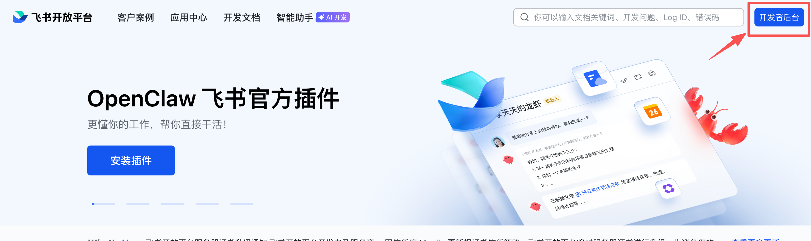
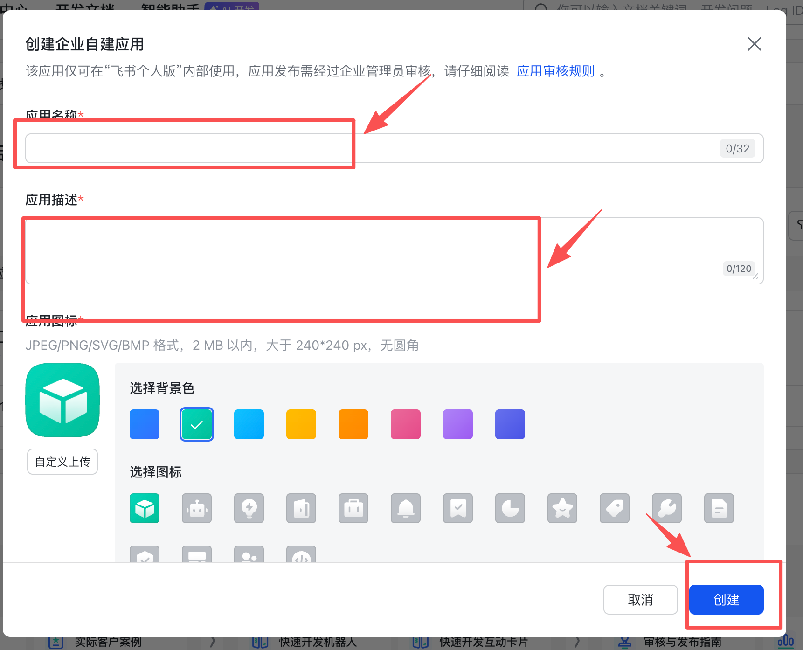
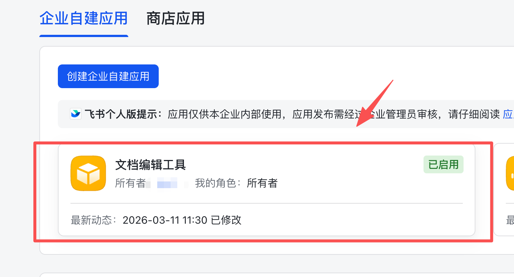
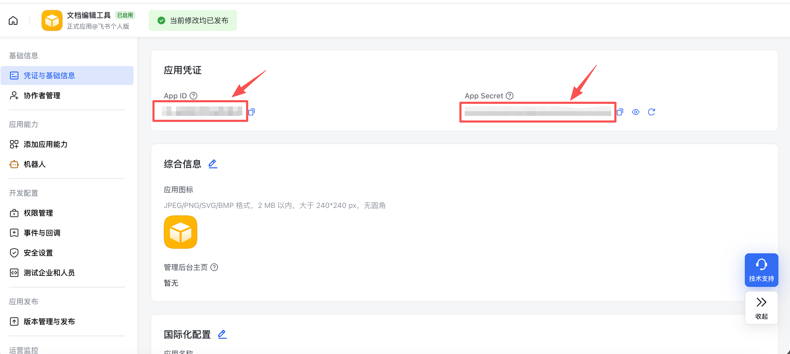
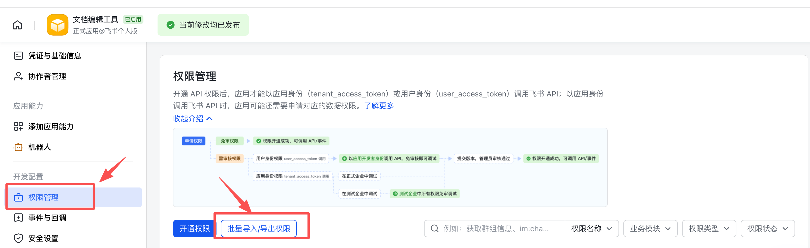
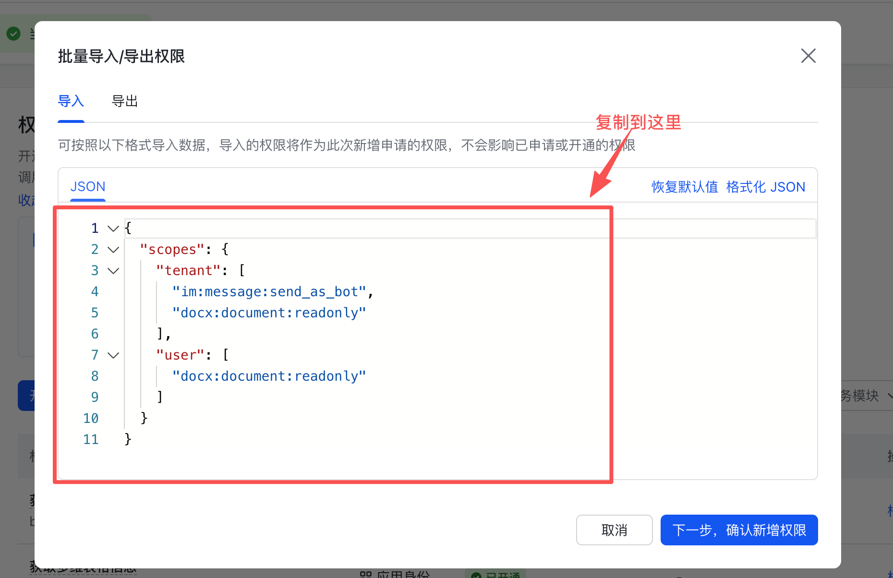
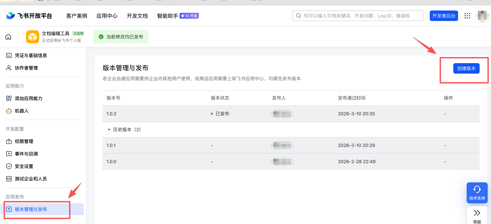

# 飞书权限申请

## 机器人创建
进入[飞书开发者平台]((https://open.feishu.cn/))，点击`开发者后台` -> `创建企业自建应用` -> `填写应用信息`





## 配置机器人

### 1、点击创建好的机器人


### 2、拿到 `app_id` + `app_secret`


### 3、开通机器人权限




#### 具体内容：
```
{
  "scopes": {
    "tenant": [
      "base:app:read",
      "board:whiteboard:node:create",
      "board:whiteboard:node:read",
      "contact:user.base:readonly",
      "contact:user.employee_id:readonly",
      "docs:document.comment:create",
      "docs:document.comment:read",
      "docs:document.comment:update",
      "docs:document.comment:write_only",
      "docs:document.content:read",
      "docs:document.media:download",
      "docs:document.media:upload",
      "docs:document.subscription",
      "docs:document.subscription:read",
      "docs:document:copy",
      "docs:document:export",
      "docs:document:import",
      "docs:event.document_deleted:read",
      "docs:event.document_edited:read",
      "docs:event.document_opened:read",
      "docs:event:subscribe",
      "docs:permission.member",
      "docs:permission.member:auth",
      "docs:permission.member:create",
      "docs:permission.member:delete",
      "docs:permission.member:readonly",
      "docs:permission.member:retrieve",
      "docs:permission.member:transfer",
      "docs:permission.member:update",
      "docs:permission.setting",
      "docs:permission.setting:read",
      "docs:permission.setting:readonly",
      "docs:permission.setting:write_only",
      "docx:document",
      "docx:document.block:convert",
      "docx:document:create",
      "docx:document:readonly",
      "docx:document:write_only",
      "drive:drive.search:readonly",
      "drive:export:readonly",
      "drive:file.like:readonly",
      "drive:file:upload",
      "sheets:spreadsheet",
      "sheets:spreadsheet:readonly",
      "space:document:delete",
      "space:document:move",
      "space:document:retrieve",
      "space:document:shortcut",
      "space:folder:create",
      "wiki:space:read",
      "wiki:space:retrieve",
      "wiki:wiki",
      "wiki:wiki:readonly"
    ],
    "user": [
      "base:app:read",
      "board:whiteboard:node:create",
      "board:whiteboard:node:read",
      "contact:user.employee_id:readonly",
      "docs:document.content:read",
      "docx:document",
      "docx:document.block:convert",
      "docx:document:create",
      "docx:document:readonly",
      "drive:file:upload",
      "offline_access",
      "search:docs:read",
      "sheets:spreadsheet",
      "sheets:spreadsheet:readonly",
      "space:document:retrieve",
      "space:folder:create",
      "wiki:space:read",
      "wiki:space:retrieve",
      "wiki:wiki",
      "wiki:wiki:readonly"
    ]
  }
}
```


## 版本发布

